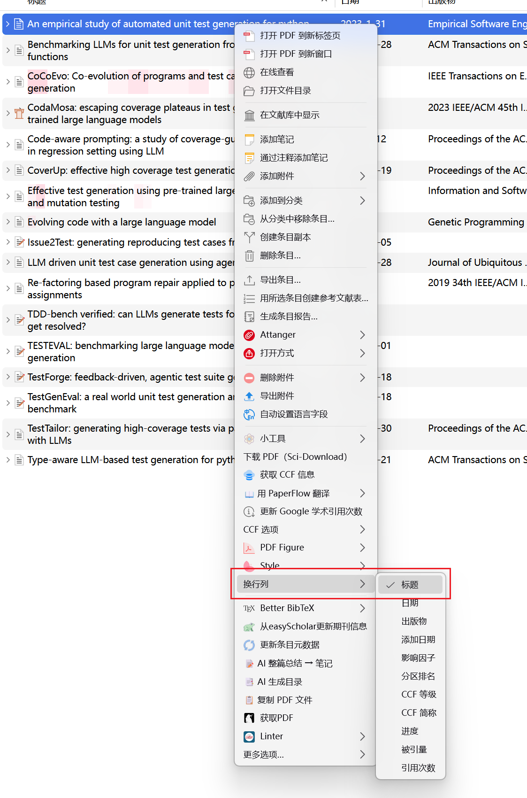

# Better Viewer
## 1.可以实现自动换行

Better Viewer 是一个 Zotero 插件，令文库条目列表换行以便阅读全部标题。

## 2.自定义列换行
如下图所示，在条目中，右键选择标题则只会针对标题进行换行

## 3.标题自适应宽度

## 致谢 / Attribution

本项目基于 [northword/zotero-itemtree-expand](https://github.com/northword/zotero-itemtree-expand)（许可证：AGPL-3.0-or-later）修改而来，特此致谢。本仓库沿用相同的 AGPL-3.0-or-later 许可，详见 [LICENSE](./LICENSE)。
