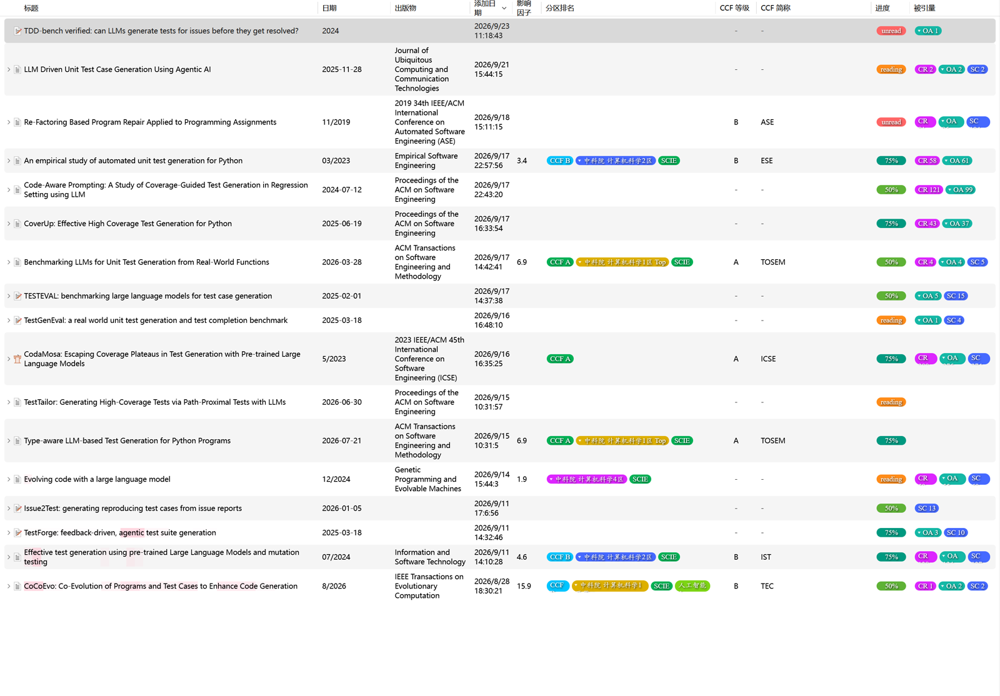
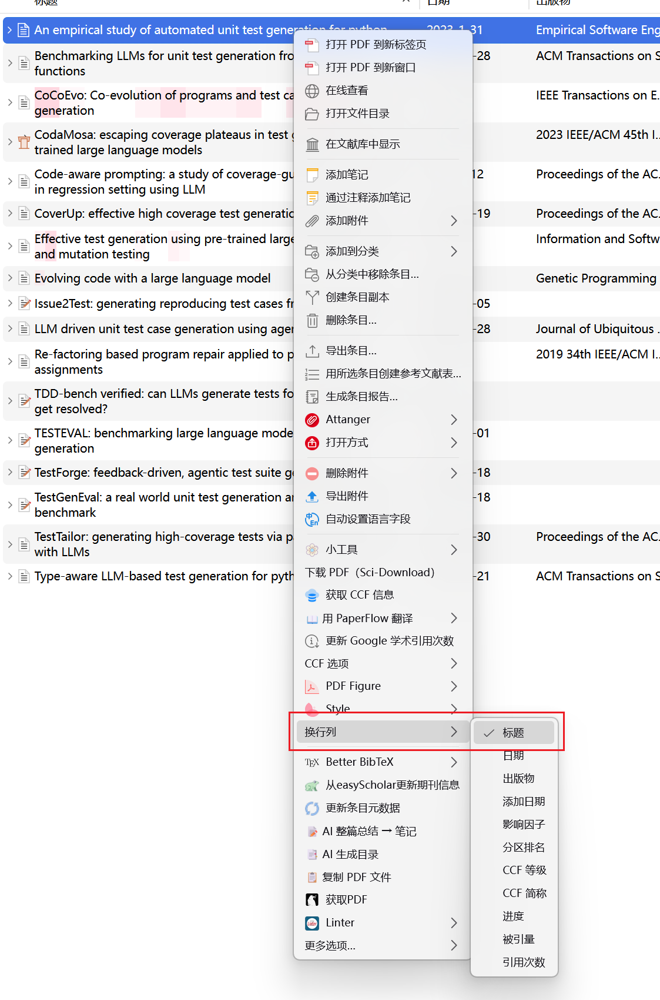
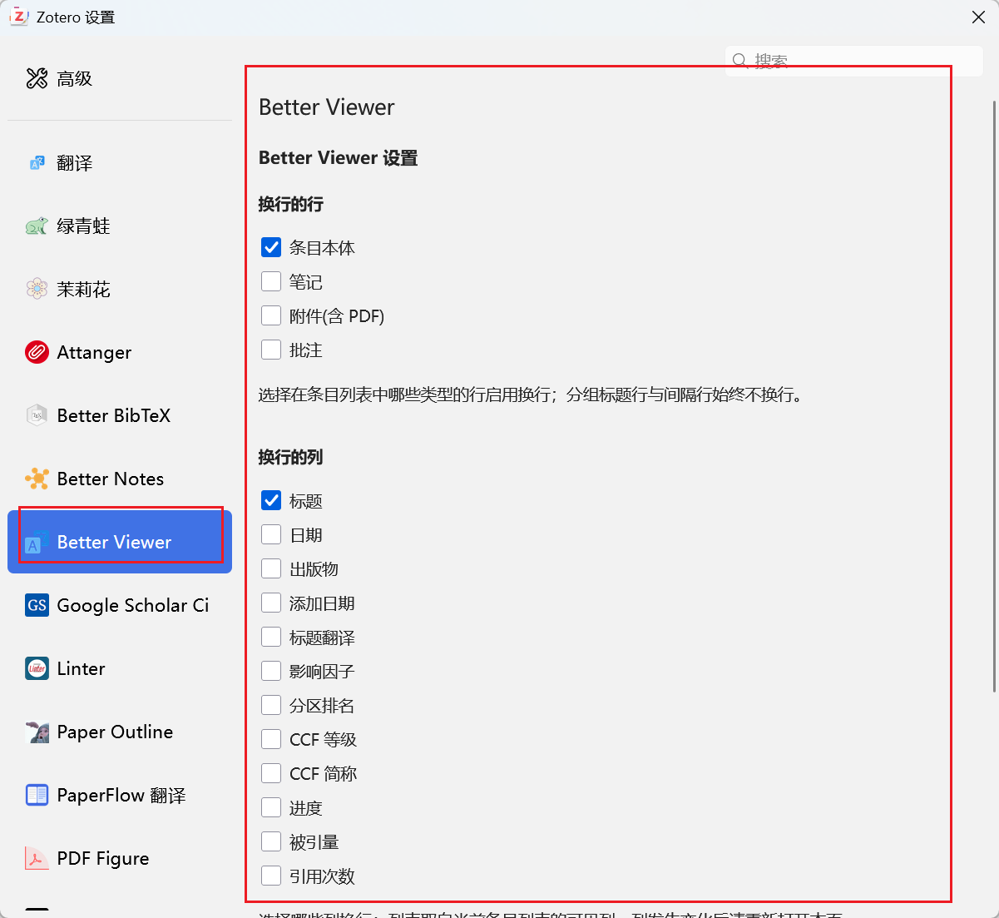
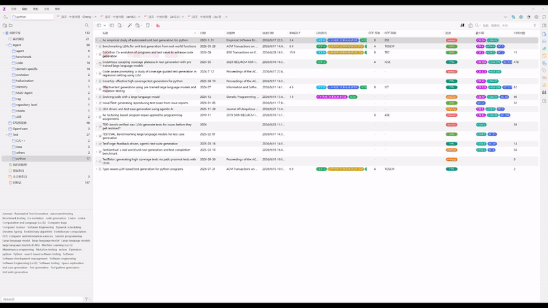

# Better Viewer

[](https://www.zotero.org)
[](https://github.com/windingwind/zotero-plugin-template)

Better Viewer 是一个 Zotero 插件，用来改善文库条目列表的阅读体验：让指定列自动换行以显示完整内容，并让列宽的调整更加顺手。

## 功能

### 1. 自动换行

条目列表默认会把过长的内容截断成省略号。开启插件后，指定列会自动换行显示完整内容。



### 2. 自定义哪些列换行

不是所有列都需要换行。可以逐列指定：

- **条目右键菜单** → 「换行列 / Wrap Columns」→ 勾选需要的列（列表按当前可见列实时生成）
- **设置面板** → Better Viewer → 「换行的列」

默认只有「标题」列换行，其余列保持单行省略号。列的选择按列名记录，所以调整列顺序、隐藏/显示列都不会失效。


设置


### 3. 自定义哪些行换行

笔记、PDF 附件、批注这些行通常不需要换行。可以在设置面板 → 「换行的行」里分别勾选：

- 条目本体（默认开启）
- 笔记
- 附件（PDF 等）
- 批注

只有被勾选的行类型会应用换行，其余行保持原样。

### 4. 列宽联动

Zotero 原生拖动列宽时，只在被拖列和它紧邻的右一列之间搬运宽度，一旦那一列压到最小就拖不动了。

本插件改为：**拖动某列时，它右侧的所有可缩放列按比例一起让路**，左侧所有列宽度保持不变，表格总宽度始终不变、不产生横向滚动。往右拖、往左拖都是同一套规则。



### 5. 自适应列宽

条目右键菜单 → 「自适应 / Auto Fit」→ 「列宽适应内容」：测量各列内容的实际宽度，把列宽调整到刚好放得下，消除省略号。

为避免用局部样本把列越调越窄，自适应**只会加宽、不会收窄**。

### 6. 自适应字号

条目右键菜单 → 「自适应 / Auto Fit」→ 「字号适应内容」：对内容放不下且未开启换行的列，按比例缩小该列字号（下限 9px），让内容完整显示。

同一菜单里的「重置字号」可以恢复默认字号。字号做过幂等处理，重复执行不会越缩越小。

### 7. 设置面板

Zotero → 设置（首选项）→ Better Viewer，可集中配置：

- 换行的行
- 换行的列
- 自适应：打开 Zotero 时自动适配列宽 / 自动适配字号（默认关闭）

所有改动即时生效，无需重启。

## 安装

1. 从 [Releases](https://github.com/GW19ddd/zotero-better-viewer/releases) 下载 `Better Viewer-*.xpi`
2. Zotero → 工具 → 插件 → 右上角齿轮 → `Install Add-on From File` → 选择该文件
3. 重启 Zotero

> 如果你之前安装过 `Expand Item Tree`（`itemtree-expand@northword.cn`），请先移除它，否则旧插件的全局换行样式会覆盖本插件的设置。

## 开发

```bash
pnpm install
pnpm build      # 产物在 .scaffold/build/
pnpm start      # 启动 Zotero 调试实例
```

## 已知限制

- 虚拟表格只渲染当前视口内的行，因此「自适应列宽 / 字号」测量的是**当前可见行**中最宽的内容。滚动到其它位置后再执行一次，结果可能不同。
- 换行后行高由 CSS 撑开，与 Zotero 内部按固定行高计算的滚动范围存在偏差，滚到底部时可能出现少量空白。
- 若所有列都被撑到上限，「列宽适应内容」可能让总宽超出容器并出现横向滚动条。
- Zotero 仅叠加更新以保证版本兼容，重度依赖的部分（如 `_columns.onResize`）在 Zotero 大版本更新后可能需要适配。

## 致谢 / Attribution

本项目基于 [northword/zotero-itemtree-expand](https://github.com/northword/zotero-itemtree-expand)（许可证：AGPL-3.0-or-later）修改而来，特此致谢。本仓库沿用相同的 AGPL-3.0-or-later 许可，详见 [LICENSE](./LICENSE)。
